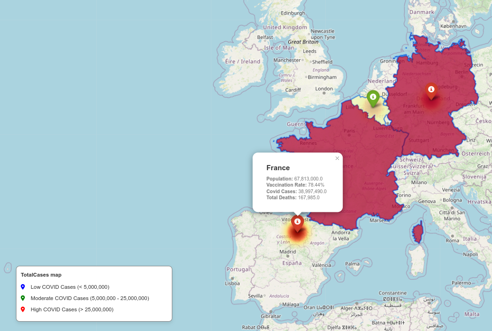

## Description:
The goal of this project is to provide an analysis of how the Covid-19 pandemic affected West European nations (Including Belgium, France, and Germany). By using the geographic data and COVID-19 data from WHO, this project is providing a good understanding of the virus's spreads and how it relates to the healthcare indicators.
The main objective of this project and its output is to examine the correlation between total cases, population and death rates, providing insight into how well these regions' healthcare systems are performing in the face of the future pandemic.

## Key User Groups:
Several user groups can use the result of this project:
- **General Audience:** People who want to learn more about the complex relationship between the regional distribution of COVID-19 cases and death rates.
- **Data Analysts:** research and analyze COVID-19 metrics in-depth in three countries of West European nations.
- **Public health and epidemiology researchers:** They can use the data to establish relationships between vaccination rates and pandemic severity.

## User Objectives:
By using this project, users can get the following goals:
- **Examine the COVID-19 Data:** Get and examine comprehensive COVID-19 data for Germany, France, and Belgium, including population statistics, vaccination rates, total cases, and total deaths.
- **Visualize Geographic map:** To see how COVID-19 has expanded geographically over West European nations.
- **Awareness of correlations:** Learn more about the relationship between the severity of the pandemic and healthcare measures (such vaccination rates). Planning policies and making educated decisions depend on having this insight.

## Visualization:
The output map have been made by using the Folium library. COVID-19 metrics are dynamically represented on the map, and users can go over the countries to see more details. This graphic image improves the user experience and makes it easier to fully understand the spatial dynamics of the epidemic.
Analyzes data using a Choropleth map to identify patterns and draw well-informed conclusions about how COVID-19 is affecting Western Europe.

